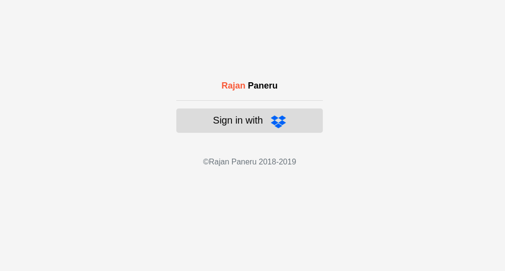
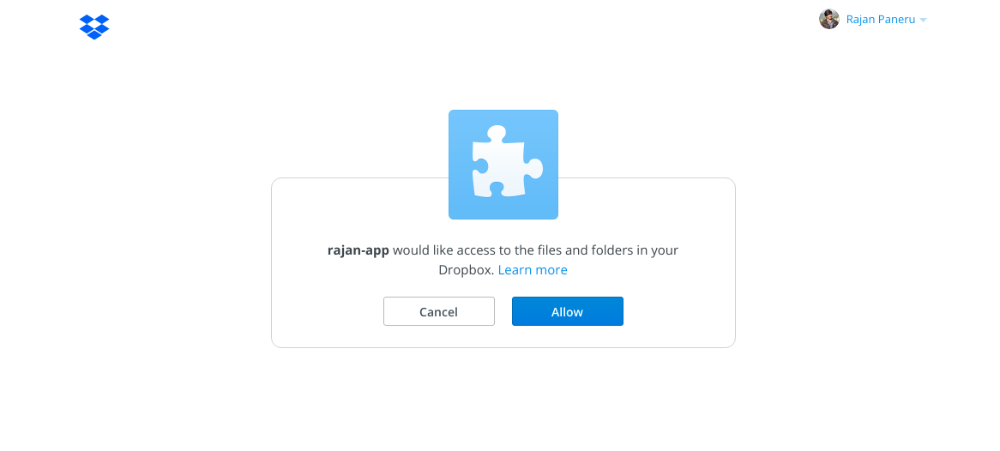
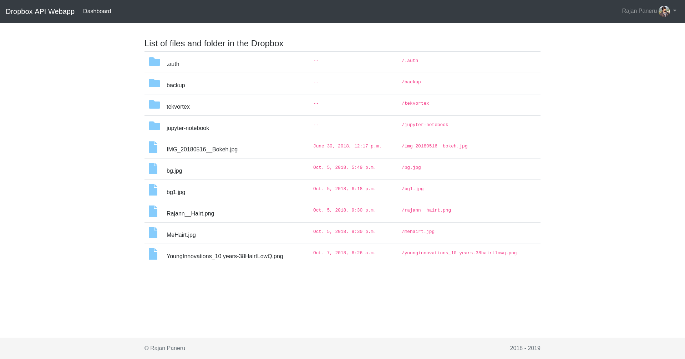

# A demo application that integrates with the Dropbox API

It's a small Django web-app, that uses OAuth 2 authorization to login then it displays Files and Folders in the parent Directory only.

It also saves the user information as well on auth table, I have used sqlite for ease, and all static content are remote.

### Prerequisites
> Note I am using `ubuntu 18` and these instructions based on my machine, If any step did not worked then please consider replacing with appropriate alternatives.
1. **Python 3.6** version is used
1. Install **pip3**
    ```
    sudo apt-get -y install python3-pip
    ```
1. Install **pipenv** [Link](https://docs.pipenv.org/install/#pragmatic-installation-of-pipenv)
    ```
    sudo pip3 install --user pipenv
    ```

### Running the Application
> I have developed a sample application name `rajan-app` on dropbox. I also included setting related to that app in [settings.py](demo/settings.py). Modify and put your application information if needed.
1. Create an app in Dropbox
    * To create your Dropbox app [Click Here](https://www.dropbox.com/developers/apps/create)
    * Under OAuth 2 add http://localhost:8000 in Redirect URIs
    * Replace the value of DROPBOX_APP_KEY and DROPBOX_APP_SECRET from dropbox App Key and App Secret respectively in [settings.py](demo/settings.py)
        ```python
        DROPBOX_APP_KEY = 'Add an app key'
        DROPBOX_APP_SECRET = 'Add an app secret'
        ```

1. Create Virtual Env, Activate, and install requirements, cd into the `dropbox-app`
    ```
    cd dropbox-app
    pipenv install
    pipenv shell
    ```

1. If it necessary Run Migrations (Otherwise there is sqlite database included with this project)
    ```
    python manage.py migrate
    ```
1. Run Application (Note: port should be 8000)
    ```
    python manage.py runserver
    ```

1. Browse the application [localhost:8000](http://localhost:8000)

### Output Images
##### Login


##### Authentication


##### Dashboard
